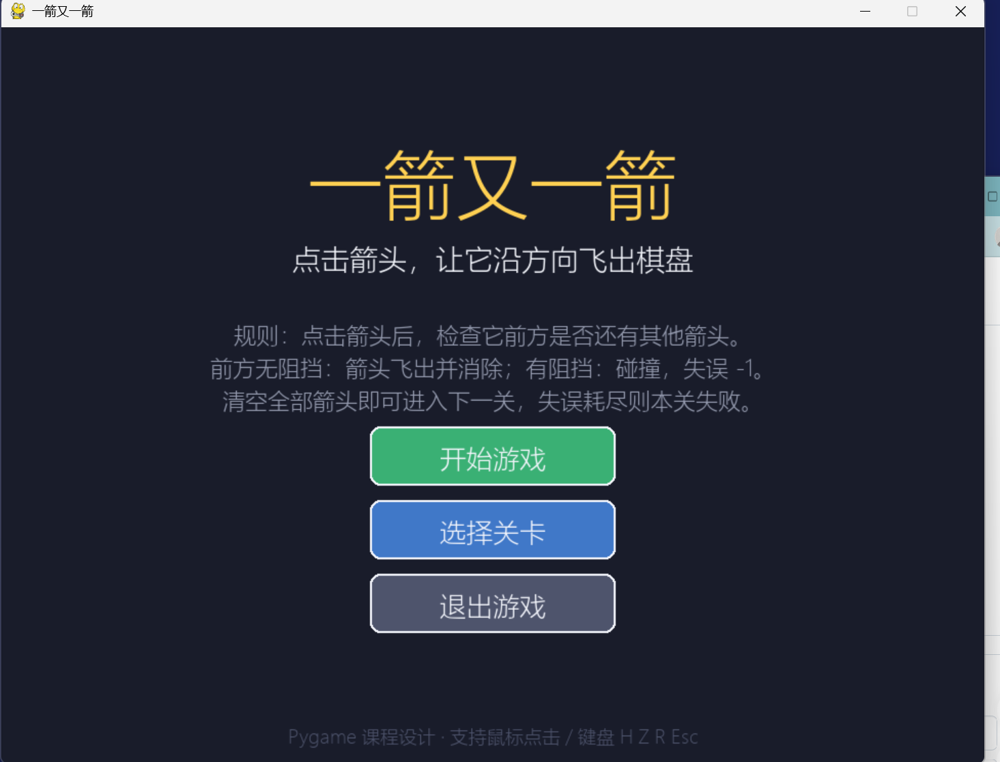
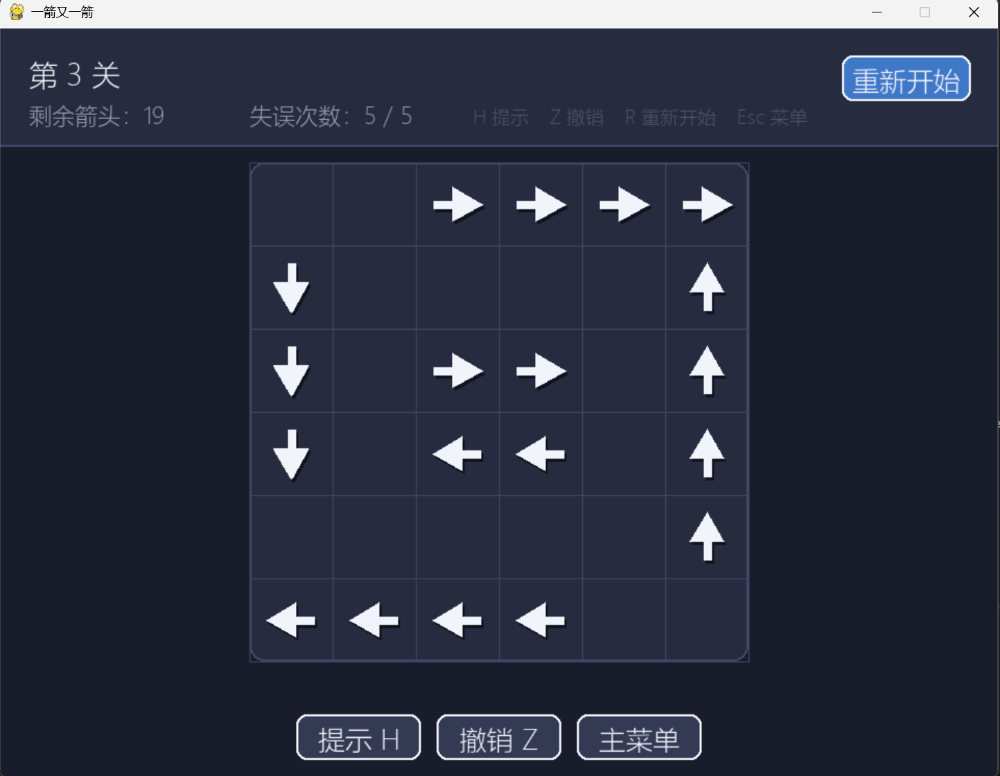
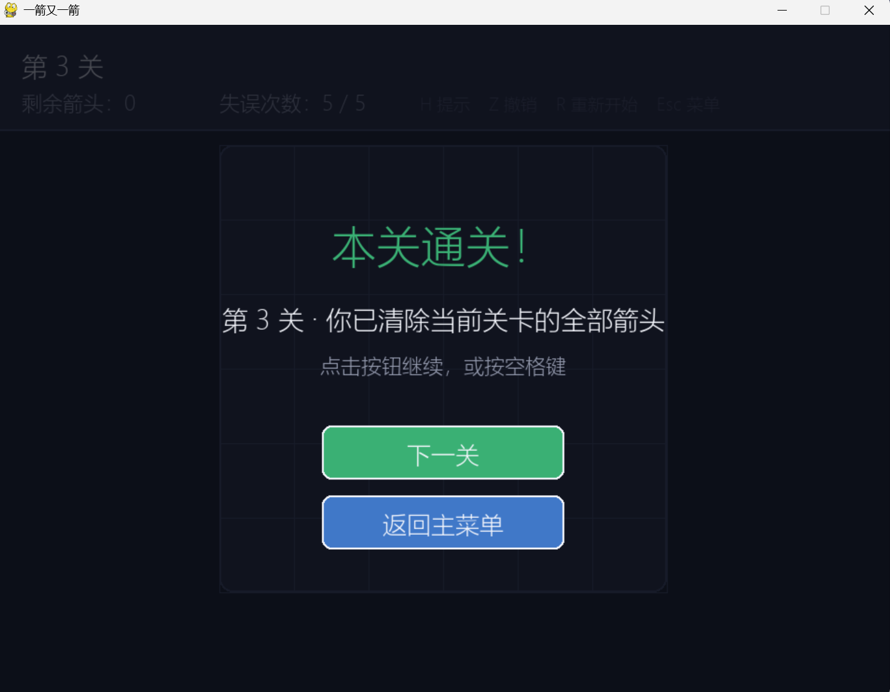

# 一箭又一箭

一个使用 Python + Pygame 开发的点击式箭头解谜小游戏。玩家依次点击棋盘上的箭头，使它们沿箭头方向飞出棋盘；如果前方仍有其他箭头挡路，箭头会碰撞并扣除一次失误机会。清空本关全部箭头即可进入下一关。

> 本项目为课程作业，参考「一箭又一箭」类小游戏的核心玩法自主实现，未使用原游戏的代码、素材或关卡。

## 游戏截图

开始：


游戏：


通关：


## 开发环境

- 操作系统：Windows 10 / 11（Python + Pygame 跨平台）
- Python 3.10 及以上（开发测试使用 Python 3.14）
- Pygame 2.5.0 及以上
- 编辑器：VS Code / PyCharm 均可

## 安装与运行

```bash
# 1. 进入项目目录
cd arrow_game_final

# 2.（可选）创建虚拟环境
python -m venv .venv
.venv\Scripts\activate        # Windows
# source .venv/bin/activate   # macOS / Linux

# 3. 安装依赖
pip install -r requirements.txt

# 4. 运行游戏
python main.py
```

## 游戏操作

- 鼠标左键：点击箭头，尝试让它飞出棋盘
- 鼠标左键：点击界面上的按钮
- `H`：提示（高亮一个当前可以飞出的箭头）
- `Z`：撤销上一步
- `R`：重新开始当前关卡
- `Esc`：返回主菜单
- `空格 / 回车`：开始游戏 / 进入下一关 / 重新开始

## 游戏规则

1. 棋盘由若干带方向的箭头组成，方向分为上、下、左、右。
2. 点击箭头后，程序检查该箭头前进方向上、箭头与棋盘边界之间是否还有其他箭头。
3. 前方没有阻挡：箭头沿方向飞出棋盘并消失，剩余箭头数 -1。
4. 前方有阻挡：箭头不能消失，会产生前冲回弹和变红抖动反馈，失误次数 -1。
5. 清空当前关卡全部箭头：显示通关界面，可进入下一关。
6. 失误次数耗尽：显示失败界面，可重新开始当前关卡。

## 关卡设计

游戏内置 6 个关卡：

- 第 1~3 关为人工设计的阻挡逻辑关卡；
- 第 4~6 关为同心环关卡，需要先清理外层箭头，内层箭头才会解除阻挡。

所有关卡都通过了验证，不存在无解关卡
